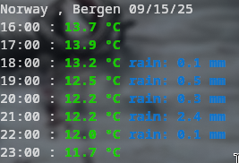

# CLIStatus

Lightweight Python CLI utility for quick system and environment checks.
## ⚠️ Work in progress — only the weather feature is implemented so far.

Currently it can fetch live weather forecasts (temperature & rain) and display them in color-coded output. More system-monitoring tools are planned.

## Installation

Clone the repo and install it locally:
```bash
git clone https://github.com/VxidDev/CLIStatus.git
cd CLIStatus
pip install .
```
### UNTESTED ON WINDOWS/MACOS! CURRENTLY OFFICIAL SUPPORT IS ONLY ON LINUX!

## Usage Examples

Example:
```bash
clistatus --weather/-w Bergen
```


